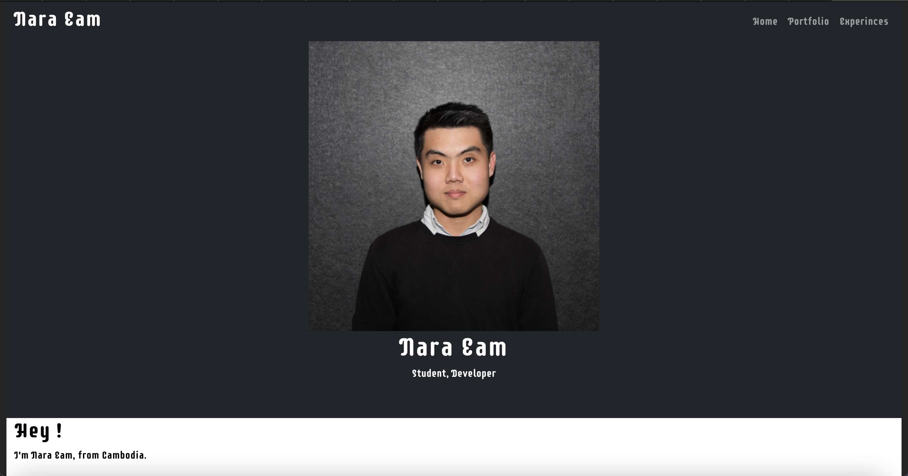

# Nara Eam's Personal Website

You can find the live website at https://nara-eam.herokuapp.com

## Frameworks and packages used

- [Material-UI](https://material-ui.com/)
- [react-bootstrap](https://react-bootstrap.github.io/getting-started/introduction/)
- [react-vertical-timeline-component](https://github.com/stephane-monnot/react-vertical-timeline)
- [react-router-dom](https://v5.reactrouter.com/web/guides/quick-start)
- ... and more!

# How clone and start the code 
## Software Requirements
- <b>Node.js</b>: Click [Here](https://nodejs.org/en/download/) to download node.js

# Windows Setup Guide
1. <b>Search 'Power Shell' in search box, and open the Power Shell. </b>
2. cd .\Desktop\
3. git clone 
